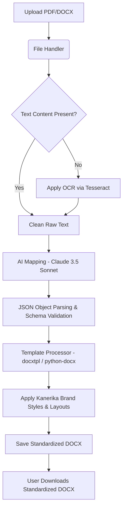

# AI Agent Context: Resume Standardization Project Upgrade

This document provides a comprehensive analysis of the existing codebase and outlines the requirements, architecture, and roadmap for upgrading it to a production-grade resume standardization tool.

---

## 1. Existing System Analysis & Flow

### End-to-End Execution Flow
Currently, the application runs as a **Streamlit** dashboard. The process flow is as follows:
1. **User Interface (`app.py`)**: The user uploads a resume (`.pdf` or `.docx`) and selects a tone (`Formal`, `Balanced`, or `Casual`) using a slider.
2. **Text Extraction (`FileHandler`)**: 
   - PDF uploads are processed using `pdfplumber`. If text extraction returns empty (indicating scanned images), the file is processed using OCR via `pytesseract`.
   - DOCX uploads are processed by reading text paragraphs through `python-docx` and joining them with newlines.
3. **Structured Information Extraction (`LLMExtractor`)**:
   - The raw text and selected tone are compiled into a prompt requesting a JSON output matching a fixed candidate schema.
   - The request is sent to Google's Gemini API (`gemini-2.0-flash`) via standard REST call.
   - The JSON response is parsed and displayed in the Streamlit UI.
4. **Document Formatting (`ResumeFormatter`)**:
   - The parsed JSON data is mapped to variables and fed into `docxtpl.DocxTemplate` using the standard template `templates/standard_resume.docx`.
   - The rendered Word document is saved locally as `generated_resume.docx` and made available for download in the UI.

### File Directory & Contribution Map
* **[app.py](file:///d:/resume%20agent/Resume-Standardization-/app.py)**: Main Streamlit application entrypoint. Sets up the upload controls, progress widgets, debug JSON viewers, and triggers the extraction and template generation classes.
* **[config.py](file:///d:/resume%20agent/Resume-Standardization-/config.py)**: Configuration file. Stores file paths, allowed extensions, Gemini API properties (temperature, top_k, max tokens), and a list of expected resume sections.
* **[create_template.py](file:///d:/resume%20agent/Resume-Standardization-/create_template.py)**: A utility script to programmatically create a mock word template with text placeholders (e.g. `${personal_info.name}`) using `python-docx`. **(TO BE REPLACED)**
* **[check_template.py](file:///d:/resume%20agent/Resume-Standardization-/check_template.py)**: Test script to verify template rendering rules for `docxtpl` and ensure Jinja-like placeholders are formatted correctly. **(TO BE REPLACED)**
* **[modules/file_handler.py](file:///d:/resume%20agent/Resume-Standardization-/modules/file_handler.py)**: Exposes [FileHandler](file:///d:/resume%20agent/Resume-Standardization-/modules/file_handler.py#L8) to read text from PDFs (with OCR fallback) and DOCX files.
* **[modules/llm_extractor.py](file:///d:/resume%20agent/Resume-Standardization-/modules/llm_extractor.py)**: Exposes [LLMExtractor](file:///d:/resume%20agent/Resume-Standardization-/modules/llm_extractor.py#L9). Prepares prompts and communicates with the Google Gemini API to retrieve structured JSON content. **(TO BE REPLACED)**
* **[modules/resume_formatter.py](file:///d:/resume%20agent/Resume-Standardization-/modules/resume_formatter.py)**: Exposes [ResumeFormatter](file:///d:/resume%20agent/Resume-Standardization-/modules/resume_formatter.py#L6) which uses `docxtpl` to populate the `standard_resume.docx` template. **(TO BE REPLACED)**
* **[modules/resume_generator.py](file:///d:/resume%20agent/Resume-Standardization-/modules/resume_generator.py)**: Exposes [ResumeGenerator](file:///d:/resume%20agent/Resume-Standardization-/modules/resume_generator.py#L6) which is a redundant version of `ResumeFormatter` that loads the programmatically-generated template from `config.py`. **(TO BE DELETED)**
* **[modules/text_extractor.py](file:///d:/resume%20agent/Resume-Standardization-/modules/text_extractor.py)**: Exposes [TextExtractor](file:///d:/resume%20agent/Resume-Standardization-/modules/text_extractor.py#L4). Contains regex pattern methods to clean and chunk resumes into hardcoded string sections. This file is **currently unused** in `app.py`. **(TO BE DELETED)**
* **[tests/test_pdf_docx.py](file:///d:/resume%20agent/Resume-Standardization-/tests/test_pdf_docx.py)**: Houses unit tests for verifying text extraction and processing. Contains multiple empty functions. **(TO BE REPLACED)**
* **[.env](file:///d:/resume%20agent/Resume-Standardization-/.env)**: Holds raw configuration keys (e.g. `GOOGLE_API_KEY`).
* **[requirements.txt](file:///d:/resume%20agent/Resume-Standardization-/requirements.txt)**: Specifies the direct dependencies of the application.

---

## 2. Current Limitations & Problems

1. **Inconsistent and Broken Templates**:
   - `config.py` specifies `templates/standard_resume_template.docx` as the path, while `ResumeFormatter` hardcodes `templates/standard_resume.docx`.
   - `create_template.py` generates a file with custom placeholders (like `${personal_info.name}`), but the `docxtpl` engine used in `ResumeFormatter` requires standard Jinja syntax (like `{{ name }}`).
   - `check_template.py` verifies a non-existent file named `"Resume Template.docx"`.
2. **Hardcoded Model Integrations**:
   - The LLM integration in `llm_extractor.py` is configured specifically for `gemini-2.0-flash` with a custom HTTP API endpoint and hardcoded prompt payloads.
   - The API key is statically loaded as `GOOGLE_API_KEY`.
3. **No Support for Complex Brand Layouts**:
   - Current template code simply dumps all section texts sequentially. It has no support for professional grids, custom font rules, color palettes, spacing constraints, sidebars, or headers.
4. **Basic UI and Debug Mode Visibility**:
   - The user interface in `app.py` displays raw internal execution logs, parsing previews, and JSON output, which is not suitable for a production customer interface.
5. **No Robust Error Catching or Logging**:
   - The application relies on general `Exception` handling and standard print statements. There is no structured logging module configured.
6. **Redundant and Unused Code**:
   - `modules/text_extractor.py` is entirely bypassed.
   - `modules/resume_generator.py` replicates the responsibilities of `modules/resume_formatter.py`.

---

## 3. Upgrade Goal

The application must be transformed into a **production-grade tool** that can ingest any standard candidate resume in PDF or DOCX format and convert it into a professional, double-column formatted DOCX file following the **Kanerika Brand Identity Guidelines**. 

The formatting engine must dynamically apply correct colors, font styling, and spacings. The AI extraction module must be robust, resilient, and leverage the Anthropic Claude API for structuring information.

---

## 4. Kanerika Template Details

The standard resume generated by the tool must match the Kanerika corporate standard:

### Layout
* **Two-Column Grid**: 
  - **Left Column (Sidebar)**: High contrast, narrow section width. Shaded with a full-height solid background color of **Kanerika Blue (`#1664E9`)** with **white text** layout.
  - **Right Column (Main Content)**: Wide section, plain white background with black/dark gray text.
* **Header**: Large candidate name and target professional title spanning the top of the resume, styled in bold.

### Section Order & Content Placement
1. **Left Sidebar Elements**:
   - **Personal Info**: Email address, Phone number, Location, and LinkedIn profile hyperlink.
   - **Skills**: Classified subcategories (e.g. Technical Skills vs Soft Skills).
   - **Certifications**: List of valid certifications and licenses.
2. **Right Column (Main) Elements**:
   - **Profile Summary**: A concise, highly polished 3-4 sentence professional pitch.
   - **Work Experience**: Comprehensive professional roles list sorted in reverse chronological order.
   - **Education**: Degrees, institutions, and graduation metrics (e.g., GPA).
   - **Projects**: Distinct key project blocks specifying details, client, role, and technologies utilized.

### AI Mapping & Formatting Rules
* **Brand Colors**: Left sidebar base must be `#1664E9`. Primary section headings on the right column should be `#1664E9`. Body text color must be `#333333` (charcoal).
* **Typography**: Professional typeface (e.g., Arial, Calibri, or Inter). Font sizes: Name 24pt, Section Headers 14pt (Bold), Body Text 10.5pt.
* **No Pronouns**: The AI summary and experience descriptions must exclude self-referential pronouns (e.g. "I", "we", "my").
* **Action-Oriented Verbs**: Experience bullet points must be re-worded to begin with powerful action verbs (e.g., *Formulated*, *Orchestrated*, *Optimized*).
* **Date Standardization**: Normalize all input dates to `MMM YYYY - MMM YYYY` (or `Present`).
* **GPA Formatter**: Map and normalize GPA metrics into standard `X.Y/4.0` or percentage scales.
* **Omission Safeguards**: If the raw resume is missing a section (e.g., no certifications), the system must cleanly omit the section header from the document instead of displaying empty brackets or blank tags.

---

## 5. Step-by-Step Production Pipeline



1. **Extract**:
   - Extract raw text from incoming files.
   - Handle scanned or image-heavy documents via an OCR pipeline.
2. **AI Map**:
   - Clean the raw extracted text.
   - Send text to **Claude 3.5 Sonnet** using a precise system prompt with JSON schema response constraints.
   - Claude formats the unstructured texts, removes pronouns, cleans dates, structures projects, and categorizes skills.
3. **Fill Template**:
   - Feed the JSON structure into the templating engine.
   - Generate the double-column tables in Word and color the sidebar cells with Kanerika Blue (`#1664E9`).
4. **Output**:
   - Validate document integrity.
   - Save file to disk and serve download stream to the client.

---

## 6. Proposed Upgrade Architecture

We will transition the codebase to a modular, production-ready design:

### Folder Structure **(TO BE BUILT)**
```
Resume-Standardization/
│
├── .env                  # Project secrets (API keys)
├── config.py             # Shared settings and parameters
├── main.py               # Combined service runner (FastAPI + Streamlit helper)
│
├── api/                  # FastAPI Backend API
│   ├── __init__.py
│   ├── routes.py         # Endpoints for Upload, Map, Generate, and Health Check
│   └── schemas.py        # Pydantic schemas for data validation
│
├── core/                 # Core modular processing pipelines
│   ├── __init__.py
│   ├── parser.py         # OCR & layout-aware PDF/DOCX extractors (REPLACES file_handler.py)
│   ├── mapper.py         # Claude 3.5 Sonnet client integration (REPLACES llm_extractor.py)
│   └── formatter.py      # Kanerika template generator engine (REPLACES resume_formatter.py)
│
├── templates/            # DOCX templates
│   └── kanerika_template.docx  # Standard double-column styled brand template
│
├── ui/                   # Streamlit Frontend UI
│   └── app.py            # Client interface consuming FastAPI endpoints (REPLACES app.py)
│
└── tests/                # Automated pytest suites
    ├── test_parser.py
    ├── test_mapper.py
    └── test_formatter.py
```

### Technology Stack
* **Web Frameworks**: 
  - **FastAPI**: Backend REST APIs with Pydantic request-response schemas.
  - **Streamlit**: Light interactive client interface that communicates with the FastAPI endpoints.
* **LLM Engine**: **Anthropic Claude API** (specifically utilizing the `claude-3-5-sonnet-latest` model) via the official Python `anthropic` SDK.
* **Document Processing**: `python-docx` (for complex sidebar table colorization, margin padding, and column structures) and `docxtpl` (for template rendering).
* **Environment Configuration**: `pydantic-settings` to enforce type-checked environment variables.
* **Model Context Protocol (MCP)**:
  - Integration of an MCP Server block to allow external AI tools (such as workspace agents) to run resume parsing pipelines, validate outputs, and inspect template states autonomously.

---

## 7. Environment & Dependencies Setup

For the upgraded version, the environment variables and dependencies will be configured as follows:

### Dependencies (`requirements.txt`) **(TO BE BUILT)**
```txt
# Web Services
fastapi>=0.100.0
uvicorn>=0.22.0
streamlit>=1.25.0
pydantic>=2.0.0
pydantic-settings>=2.0.0

# Document Utilities
python-docx>=0.8.11
docxtpl>=0.16.7
pdfplumber>=0.10.2
pytesseract>=0.3.10
Pillow>=10.0.0

# AI Client
anthropic>=0.5.0

# Dev & Tests
pytest>=7.3.0
httpx>=0.24.0
python-dotenv>=1.0.0
```

### Environment Variables (`.env`)
The following environment variables must be defined in the `.env` file for development and production:
```bash
# Claude API Key
ANTHROPIC_API_KEY=your_anthropic_api_key_here

# App Environment Configuration
APP_ENV=development
API_HOST=127.0.0.1
API_PORT=8000

# Tesseract Path (Required if not in system PATH for OCR)
TESSERACT_CMD=C:\Program Files\Tesseract-OCR\tesseract.exe
```

---

## 8. Implementation Roadmap (Phases)

To ensure a smooth transition, the project will be upgraded in two distinct phases:

### Phase 1: Core MVP Scope (Immediate Goals) **(TO BE BUILT)**
1. **Claude API Integration**: Replace the Gemini REST api inside `llm_extractor.py` with a new module (`core/mapper.py`) using the official `anthropic` Python SDK and a robust system instruction template.
2. **Kanerika Brand Template creation**:
   - Establish `templates/kanerika_template.docx` with the brand colors (`#1664E9`), a two-column table, sidebar format, and custom font weights.
   - Clean up conflicting template logic. Make `core/formatter.py` the single source of truth for filling the template.
3. **Robust AI Formatting Engine Rules**:
   - Implement date cleaning, profile summarizing logic, and action-verb formatting rules in the LLM system prompt.
   - Handle empty sections dynamically to avoid rendering raw brackets in the output document.
4. **Streamlit UI Streamlining**:
   - Clean up `ui/app.py` to hide system debug elements.
   - Provide a polished UI that simply allows file upload, tone custom instruction text, and direct file download.
5. **Basic Test Verification Suite**:
   - Write unit tests in `tests/` utilizing mocked Claude API calls to test parsing correctness.

### Phase 2: Production Grade Scale (Future Goals) **(TO BE BUILT)**
1. **FastAPI Backend**:
   - Build a production REST backend to expose extraction and standardization APIs, enabling independent scalability and standard deployment.
2. **Database Integration**:
   - Support SQLite or PostgreSQL to keep a record of parsed resumes, success rates, and user analytics.
3. **Bulk Processing**:
   - Ingest multiple resumes in standard zip archives and run standardization in async background tasks.
4. **Interactive Editor**:
   - Implement a Streamlit sidebar component allowing users to live-edit the AI-mapped fields before generating the final `.docx` standard template output.
5. **Dockerization**:
   - Create a `Dockerfile` multi-stage build encapsulating the API service, Streamlit UI, and system-level `tesseract` binaries.
